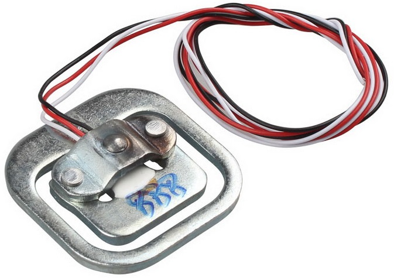
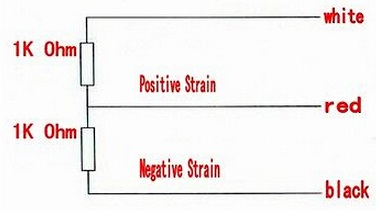
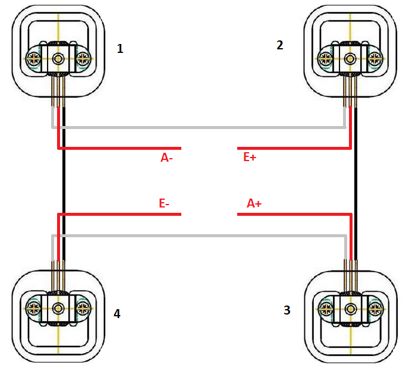
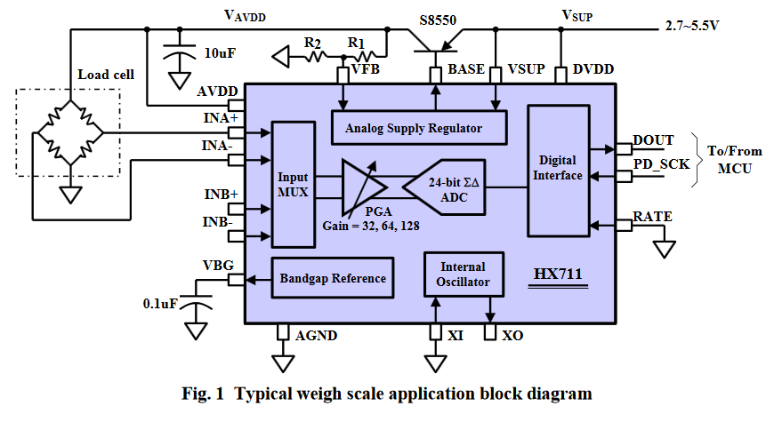
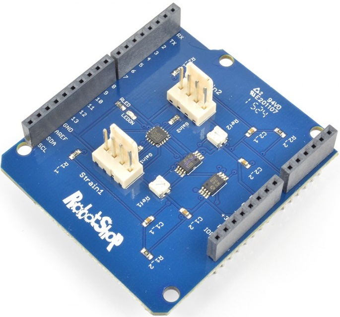
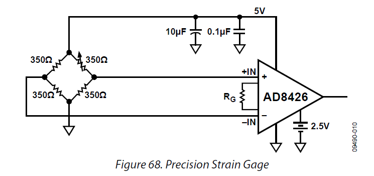
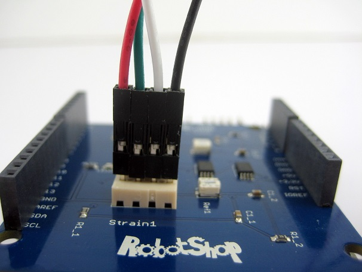
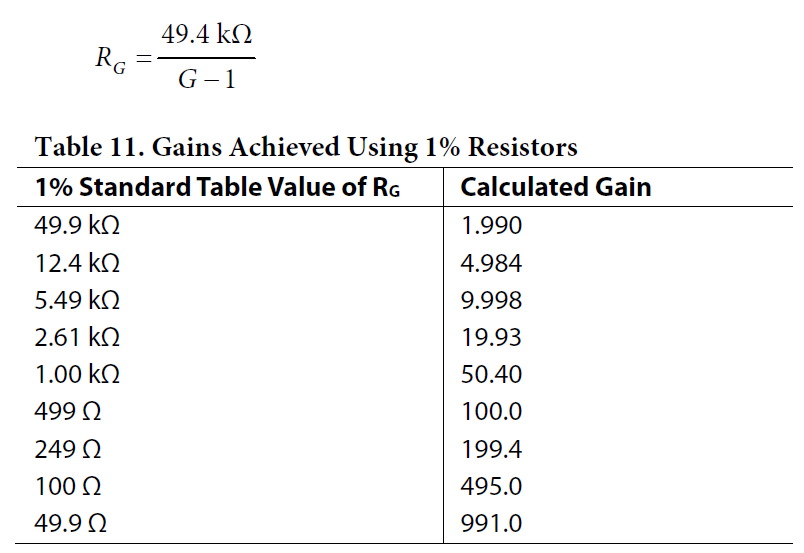
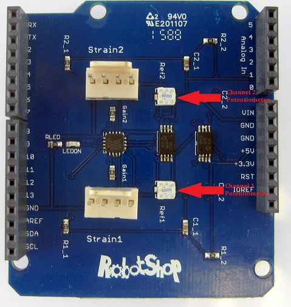

# Mesure de masse avec Arduino #

## Principe ##

Pour mesurer une masse, on utilise des capteurs appelés jauges de contraintes ou jauges d'extensiométrie. Le principe de la mesure repose sur le fait qu'une force appliquer sur une poutre va entrainer sa déformation. C'est cette déformation, proportionnelle à la force appliquée que l'on va en fait mesurer à l'aide d'une jauge. Cette dernière subit la même déformation que la poutre, ce qui entraine proportionnellement une variation de sa résistance électrique : 

- La masse crée la force (pesanteur)
- La force déforme la poutre et la jauge
- La résistance de la jauge est mofifée proportionnelement à la déformation subie
- La jauge est parcourue par un courant, elle délivre à ses bornes une tension proportionelle à la déformation, donc à la masse.

Exemple d'une poutre munie de deux jauges montées dans un pont de Wheatstone :

## Capteurs utilisés ##

Les capteurs utilisés sont des capteur de poids 50 kg SFE disponiblent chez plusieurs revendeurs dont Roboshop (http://www.robotshop.com/eu/fr/capteur-poids-50-kg-sfe.html)

Modèle électrique :

Câblage du pont

Le système de pesée est constitués de 4 capteurs SFE, un pour chaque pieds, ils seront connectés en pont de Wheatstone selon le schéma suivant :

- E+ : Alimentation + du pont (5V)
- E- : Alimentation - du pont (GND)
- A+ : Signal +
- A- : Signal -

La tension de mesure proportionnelle à la masse pesée est prise entre A+ et A- : Vo = A+ - A-

## Mesure ##

La tension Vo en sortie du pont est trop faible pour être exploitée directement par le CAN d'Arduino. On peut utiliser un CNA 24 bits qui permettra d'avoir une meilleure résolution ou encore un amplificateur différentiel. 

### Choix d'un module ###

Plusieurs modules sont disponibles, on trouve souvent le HX711 qui combine Amplificateur et CNA 24 bits :

[https://www.sparkfun.com/products/13879](https://www.sparkfun.com/products/13879 "https://www.sparkfun.com/products/13879")

La mise en oeuvre est grandement facilité par l'utilisation de librairies dédiées que l'on doit à divers contributeurs :

- [https://github.com/sparkfun/HX711-Load-Cell-Amplifier](https://github.com/sparkfun/HX711-Load-Cell-Amplifier "https://github.com/sparkfun/HX711-Load-Cell-Amplifier")
- [https://github.com/bogde/HX711](https://github.com/bogde/HX711 "https://github.com/bogde/HX711")
- [https://github.com/aguegu/ardulibs/tree/master/hx711](https://github.com/aguegu/ardulibs/tree/master/hx711 "https://github.com/aguegu/ardulibs/tree/master/hx711")

Pour rester plus classique, j'ai opté pour une solution à base d'amplificateur différentiel intercalé entre la sortie du pont et le CNA d'Arduino. RobotShop propose un shield à base du AD8426.

[http://www.robotshop.com/en/strain-gauge-load-cell-amplifier-shield-2ch.html](http://www.robotshop.com/en/strain-gauge-load-cell-amplifier-shield-2ch.html "http://www.robotshop.com/en/strain-gauge-load-cell-amplifier-shield-2ch.html")

Instructions de mise oeuvre : [http://www.robotshop.com/blog/en/interfacing-a-load-cell-with-an-arduino-board-16247](http://www.robotshop.com/blog/en/interfacing-a-load-cell-with-an-arduino-board-16247 "http://www.robotshop.com/blog/en/interfacing-a-load-cell-with-an-arduino-board-16247")

### Connexion ###

On peut connecté deux ponts, un seul suffira, On choisira `Strain1`

- `Rouge : E+`
- `Vert  : A-`
- `Blanc : A+`
- `Noir  : E-`

### Réglage du gain ###

Le réglage du gain se fait grace à la résistance RG. Malheusement, sur ce shield, c'est une résistance CMS de 100 Ohm, difficilement modifiable, à moins de la désouder pour la remplacer.

Comme on peut le lire sur le tableau ci-dessus, le gain sera de 495. 

- Les jauges donnent 1mV/V à pleine charge donc alimentées en 5V, on aura 5mV max.
- Le montage en pont permet d'obtenir 2x5mV => 10 mV max à pleine charge (200kg).
- Avec l'amplification on a 4,95 V max en entrée du CAN (Strain1 sur A0)

Donc, ça devrait aller !

### Réglage de l'offset ###

Un potentiomètre présent sur le shield permet de décaler la tension de sortie de l'amplificateur pour prendre en compte, par exemple une déformation dans deux sens, ce qui entrainerait une tension en sortie du pont, positive dans un sens et négative dans l'autre. L'ampli étant alimenté entre 0 et 5V, il ne pourrait pas restituer la partie négative. Dans notre cas la déformation est toujours dans le même sens, on va donc tourner ce potentiomètre pour obtenir une tension de décalage la plus petite possible ( 0V sur A0 dans l'idéal).

## Calibrage ##

Le calibrage consiste à faire correspondre la valeur de la tension convertie en numérique sur A0 avec la valeur d'une masse connue placée sur le plateau de la balance.

Le programme d'exemple Arduino Basic/AnalogReadSerial.ino convient parfaitement cette procédure :

    void setup() {
      // initialize serial communication at 9600 bits per second:
      Serial.begin(9600);
    }
    
    // the loop routine runs over and over again forever:
    void loop() {
      // read the input on analog pin 0:
      int sensorValue = analogRead(A0);
      // print out the value you read:
      Serial.println(sensorValue);
      delay(1000);// delay in between reads for stability
    }

Téléverser le programme puis :

- Mesure du décalage : 
	- Relever la valeur à vide (rien sur le plateau)
	- Tourner le potentiomètre jusqu'à obtenir la valeur la plus faible possible
	- Cette valeur s'appelera `offset : offset=sensorValue` pour m = 0g
- Calibrage :
	- Placer sur le plateau une masse connue, par exemple 5 kG.
	- Relever la valeur en charge
	- Cette valeur s'appellera `cal : cal=sensorValue` pour m = 5000g
- Calcul de la fonction de transfert `m(g) = f(sensorValue)`
	- Cette fonction de transfert est une droite : m(g) = a.sensorValue + b
	- `a = 5000 / (cal - offset)`
	- `b = 5000 - a.cal`

## Programme basic ##

    void setup() {
      Serial.begin(9600);
    }
    
    void loop() {
      // read the input on analog pin 0:
      int N = analogRead(A0);
      float masse;
      masse = 278.0*(float)N - 13066.0;
      //  print out the value you calcul:
      Serial.print(N);
      Serial.print(" | ");
      Serial.print(masse);
      Serial.println(" g");
      delay(1000);// delay in between reads for stability
    }

